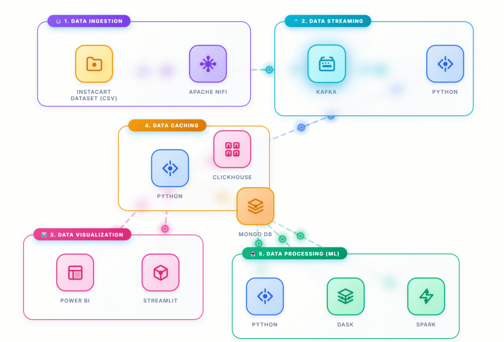
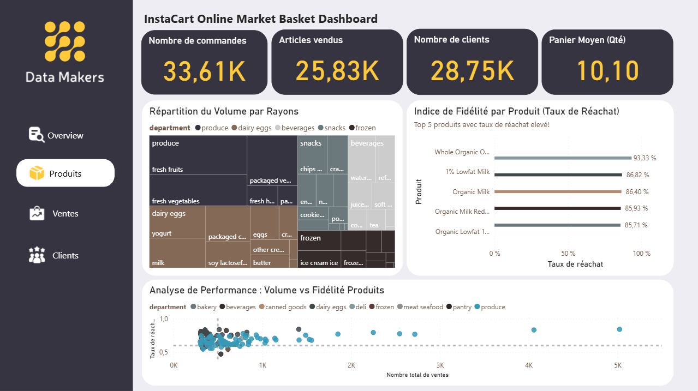
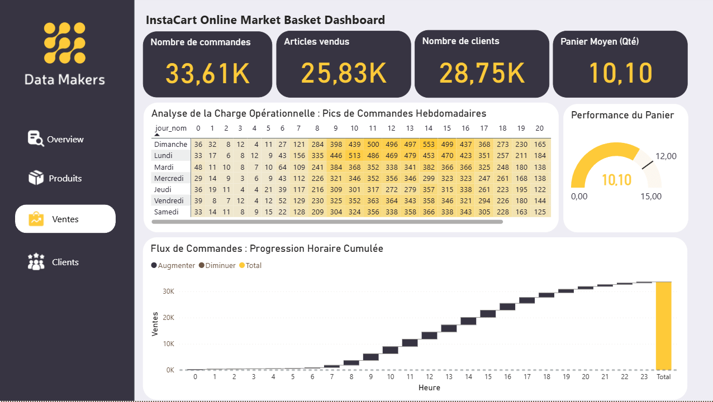

# 🛒 Instacart Real-Time Supply Chain Pipeline

<div align="center">


**Un pipeline Big Data de bout en bout pour prédire la demande et optimiser les stocks en temps réel.**
*Basé sur le dataset public Instacart.*

</div>

---

## 🚀 Objectif du Projet
**Réduire le gaspillage alimentaire et éviter les ruptures de stock grâce à une architecture Data Streaming et au Machine Learning.**

* 🔴 **Problème :** Gestion statique des stocks inefficace face à la volatilité de la demande.
* 🟢 **Solution :** Ingestion temps réel et prédiction du prochain achat utilisateur.
* 📈 **Performance ML :** Modèle Random Forest avec un **R² de 0.79**.

---

## 🏗️ Architecture Technique


*(Schéma du pipeline de données : De l'ingestion NiFi à la visualisation Streamlit)*

### 🛠️ Tech Stack

| Composant | Technologies | Rôle & Caractéristiques |
| :--- | :--- | :--- |
| **Ingestion** |  | Gestion de flux, Idempotence, Backpressure |
| **Streaming** |  | Message Broker haute performance & Zookeeper |
| **Stockage** |   | Analytics OLAP (ClickHouse) & Métadonnées (MySQL) |
| **Processing** |  | Pandas, Kafka-Python, OpenLineage |
| **ML & AI** |  | Random Forest (Prédiction de demande) |
| **Visu** |   | Apps Data Temps Réel & Analyse historique |
| **Ops** |  | Conteneurisation complète |

---

## 📊 DASHBOARD POWER BI





---

## 📦 Installation & Démarrage

Suivez ces étapes pour lancer le projet en local.

### 1. Pré-requis
* **Docker** & **Docker Compose** installés.
* **Python 3.9+** installé.
* **Git** installé.

### 2. Clonage du projet
```bash
git clone https://github.com/ejabra/Instacart-Pipeline.git
cd instacart-pipeline
```
### 3. Lancement de l'infrastructure (Docker)
Démarrez les conteneurs (Kafka, NiFi, ClickHouse, Zookeeper, Marquez).
```bash
docker-compose up -d
```
⚠️ Note : Assurez-vous que les ports 8080, 9092, 8123 et 3000 sont libres sur votre machine.

---

## ▶️ Utilisation
Étape 1 : Démarrer le Consumer (Enrichissement & Stockage)
Ce script écoute Kafka, enrichit les données via MySQL et les insère dans ClickHouse.
```bash
python consumer.py
```
### Étape 2 : Lancer le Dashboard de Monitoring
Visualisez les flux de données en temps réel et les prédictions.
```bash
streamlit run app.py
```

## 📊 Fonctionnalités Clés
✅ Ingestion Résiliente : Gestion des doublons (Deduplication) et transformation à la volée via Apache NiFi.

✅ Analytics Temps Réel : Calcul instantané des KPIs (Panier moyen, Top produits) grâce à la puissance de ClickHouse.

✅ Data Lineage : Traçabilité complète des données (Provenance) compatible avec OpenLineage/Marquez.

✅ Prédiction de Stock : Algorithme de Machine Learning pour estimer les volumes de commandes futurs.

## 👥 Auteurs
Ce projet a été réalisé dans le cadre du PFE JobInTech (Ynov Campus) par :

Brahim DARGUI - Data Engineering & Architecture

Nouhaila BENNANI - Data Analysis & Machine Learning

2025 - Projet Open Source à but éducatif.
